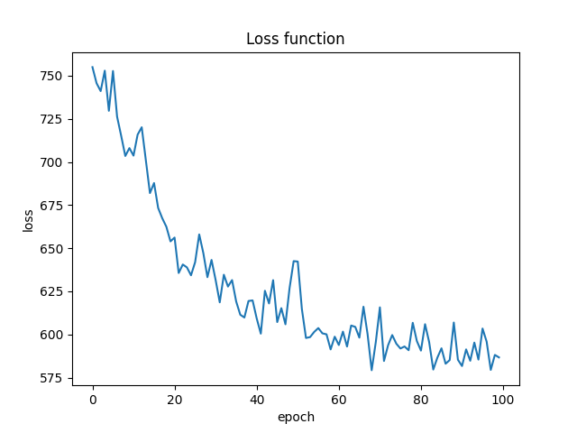
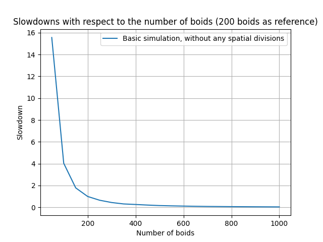
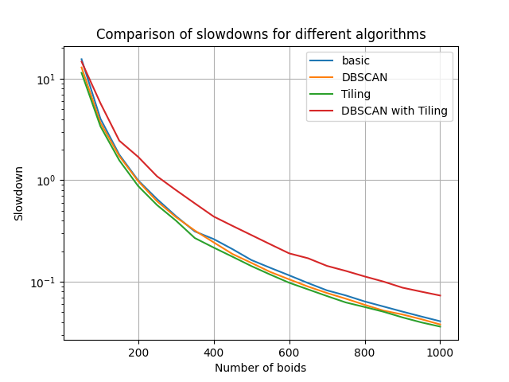

# A5_GraphNeuralNet_PartDynamics
Projekt z przedmiotu Informatyka Systemów Złożonych na kierunku Informatyka Akademii Górniczo-Hutniczej w Krakowie, dotyczący implementacji wybranego modelu boid dynamics.

## Autorzy
- Hubert Czader ([@HubertCzader](https://github.com/HubertCzader))
- Paweł Hanusik ([@pawelhanusik](https://github.com/pawelhanusik))

## Spis treści:
1. [Wybrany model](#1-wybrany-model)
2. [Opis modelu](#2-opis-modelu)
3. [Zebrane dane](#3-zebrane-dane)
4. [Aproksymacja dynamiki agentów przy pomocy GNN'ów](#4-aproksymacja-dynamiki-agentów-przy-pomocy-gnnów)
5. [Uruchomienie symulacji dla większej liczby boidów](#5-uruchomienie-symulacji-dla-większej-liczby-boidów)
6. [Próba aproksymacji dynamiki agentów dla większej liczby boidów przy użyciu GNN'ów](#4-proba-aproksymacji-dynamiki-agentów-dla-większej-liczby-boidów-przy-użyciu-gnnów)

## 1. Wybrany model

Wizualizacja:

---

## 2. Opis modelu:

1. Dane boidów:
    1. Każdy boid jest bytem o wymiarach 15x15.
    1. Każdy porusza się z tą samą prędkością.
    1. Każdy ma określoną pozycję (`pos`) oraz kąt (`a`).
1. Ruch:
    1. Każdy boid porusza się z zadaną prędkością w kierunku zadanego kąta (`a`).
    1. Na podstawie poniższych reguł zmieniany jest kąt (`a`).
1. Reguły (dla każdego boida):
    1. Obliczana jest średnia pozycja (`avg_pos`) oraz średni kąt (`avg_a`) pobliskich boidów, czyli następujących:
        - znajdujące się w oddaleniu o 180
        - z nich wybieranych jest 7 najbliższych.
    1. Jeśli:
        1. Boid jest zbyt blisko innego boida (odległość < 8), to zmienia kąt na taki, który pozwoli mu najszybciej się oddalić.
        1. abs(`avg_pos` - `pos`) < 90, to zmienia kąt na `avg_a`.
        1. abs(`avg_pos` - `pos`) >= 90, to zmienia kąt na taki, który pozwoli mu najszybciej się zbliżyć do avg_pos.
    1. Zmiana aktualnego kąta na ustalony powyżej następuje z prędkością `2.4` stopnia na klatkę.
  
---

## 3. Zebrane dane

Dane zostały zapisane w formacie binarnym. Pierwszy int to liczba boidów. Następnie dla każdej klatki zapisywane są 3 floaty dla każdego boida: x, y, a.

Następnie dane zostały przekonwertowane przy pomocy skryptu `parseDataToNp.py` na dane szeregów czasowych w formacie, który oczekuje na wejściu SwarmNet.

---

## 4. Aproksymacja dynamiki agentów przy pomocy GNN'ów

Do aproksymacji został wykorzystany model `SwarmNet`. Model był uczony przez 100 epok
na danych zebranych z 16 minut symulacji, w której brało udział 50 boidów.

"Długość" danych wejściowych oraz liczba boidów były ograniczone ilością pamięci
RAM (32GB) oraz VRAM (12GB). Proces uczenia trwał ok. 5.5h.

Poniżej przedstawiono wykres lossu podczas uczenia:

Wyniki aproksymacji zostały przedstawione na poniższym filmie.  
Boidy niebieskie to boidy z symulacji, boidy czerwone to boidy wygenerowane przez model.

Jak widać czerwone boidy w ogóle nie pokrywają się z niebieskimi. Jednak można zauważyć, iż wykazują
się w pewnym stopniu podobnymi zachowaniami.

Można zauważyć odbijanie się od brzegów:

Jak widać brzeg jest przesunięty lekko w dół, jednak dla wszystkich jest w tym samym miejscu.  
Dla lewego brzegu działa analogicznie, jednak dolny i prawy znajdują się "poza mapą", tnz boidy na chwilę znikają, jednak potem wracają.

Poniżej widać grupowanie się boidów, jednak nie wszyscy sąsiedzi są brani pod uwagę.

Jak widać stworzyły się dwie grupy: jedna podróżuje w górę, druga w dół. Mimo, iż boidy z tych dwóch grup powinny się odpychać, to jednak nie robią tego.

Dodatkowo na podglądzie ogółu widzimy, że z czasem boidy poprawnie się grupują.

--- 

## 5. Uruchomienie symulacji dla większej liczby boidów

W odpowiedzi na potrzebę zwiększenia wydajności symulacji, opracowano jej uproszczoną wersję, która jednak zachowuje kluczowe cechy i zachowania. Wymiar boidów został zachowany, a także analogicznie jak poprzednio, mają one zdefiniowane są jego pozycja (pos) i kąt (a). Ponadto, zachowanie agentów można opisać za pomocą następujących punktów:

1. Boidy poruszają się tak, aby uniknąć zderzenia ze sobą.
1. Boidy poruszają się zgodnie ze średnim kierunkiem otaczających je Boidów.
1. Boidy poruszają się w stronę środka otaczających je Boidów.

Poniżej przedstawiona została utworzona została symualacja dla 150 boidów.

Dla tak zdefiniowanych warunków złożoność obliczeniowa pojedynczego agenta jest niewielka. Nie mniej w momencie gdy rozważane jest ich całe stado, pojedynczy boid  musi wziąć pod uwagę wszystkie inne boidy, aby wyliczyć aktualną wartość prędkości. Widać to szczególnie na przykładzie poniższego wykresu. W celu zbadnania wydajności posłużono się miarą spowolnienia (ang. slowdown), która to jest wyrażana jako stosunek czasu trwania symulacji dla zdefiniowanego stanu (w naszym przypadku dla 200 osobników) do czasu symulacji dla stanu akrualnego trwającej w czasie rzeczywistym. Zatem poniżej przestawiono wykres zależności tak wyliczonego spowolnienia w zależności od liczby boidów biorących udział w symulacji. 

Na wykresie tym widać, że wydajność algorytmu spada eksponencjalne wraz ze wzrostem liczby boidów. Pokazuje to tylko jak bardzo symulacja obciążona jest pracą w momencie gdy zwiększana jest liczba agentów. Jednym z bardziej znanych sposobów na poprawę wydajności jest wykorzystanie struktur danych przestrzennych. Algorytm symulacji w swojej bazowej wersji wykorzystuje do obliczeń wszystkie inne boidy znajdujące się w środowisku. Jednak na aktualizację ich prędkości wpływają tylko boidy, w pobliżu których się znajdują. Struktury danych przestrzennych przechowują boidy na podstawie ich pozycji, co pozwala na porównanie tylko boidów, które są przechowywane razem. Prowadzi to więc do znacznego zmniejszenia liczby wymaganych obliczeń, a tym samym do zwiększenia wydajności.

### DBSCAN

DBSCAN (Density-Based Spatial Clustering of Applications with Noise) to popularny algorytm uczenia nienadzorowanego który ma na celu analizę i symulację zachowań zbiorowych w systemach agentów na podstawie zdefiniowanych lokalnych reguł interakcji. W omawianym problemie dynamiki boidów DBSCAN dzieli wszystkich agentów na mniejsze podgrupy pod postacią podrojów. Doprowadza to do sytuacji, w której wpływ na zachowanie agenta mają jedynie boidy znajdujące się w tym samym podroju. To umożliwia znaczącą redukcję ilości wymaganych obliczeń, ponieważ podczas ich przeprowadzania algorytm DBSCAN musi brać pod uwagę jedynie lokalizacje boidów, traktując je jako punkty, co pozwala na ich szybką klasteryzację. Działnie algorytmu DBSCAN przedstawione zostało poniżej.

Zwiększanie liczby obszarów może poprawić efektywność symulacji Boidów, przybliżając wydajność do liniowej względem ilości Boidów. Jednak problemem, który często jest pomijany, jest to, że w większych przestrzeniach efektywność układania płytek nie jest tak istotna, ponieważ liczba tak definiownaych obszarów obszarów zwiększa się proporcjonalnie do kwadratu rozmiaru środowiska, czyli całkowitego obszaru, po którym poruszają się agenci. Chociaż obliczanie na bieżąco prędkości dla każdego boida ma złożoność liniową (O(n)), gdzie n to liczba boidów w pobliżu, przez wzgląd na opisane okoliczności algorytm ten sprawdza siuę w środowiskach z mniejszą liczbą występujących boidów. Niestety, zwiększająca się eksponecjalnie złożoność zwiększania liczby obszarów przy stałym rozmiarze przestrzeni całkowitej negatywnie wpływa na poprawę wydajności dla omaianego środowiska, w którym to całkowity obszar jest stały i nie ulega zmiaine, natomiast liczba agentów się zwiększa.

### Tiling

### Porównanie wydajności algorytmów

Poniżej przedstawiono tak oto powstały algortytm:

---

## 6. Próba aproksymacji dynamiki agentów dla większej liczby boidów przy użyciu GNN'ów

Dla wydajniejszego nowo powstałego wariantu symulacji ponowiono próbę apoksymacji dynamiki agentów dla zwiększonej liczby boidów przy użyciu wcześniej użytej sieci SwarmNet opartej o GNN. Wybór ten został podyktowany faktem, że alternatywna sieć GNbS (Graph Network-based Simulator), używana głównie do modelowania zachowań płynów i cieczy, nie znalazła zastosowania w naszym badaniu. Mimo zredukowanej ilości potrzebnych obliczeń, przy próbie przeprowadzenia treningu dla 500 boidów, sieć zgłosiła potrzebę alokacji około 400 Gb pamięci VRAM. Niestety, realizacja tego zadania w warunkach domowych okazała się niemożliwa.
